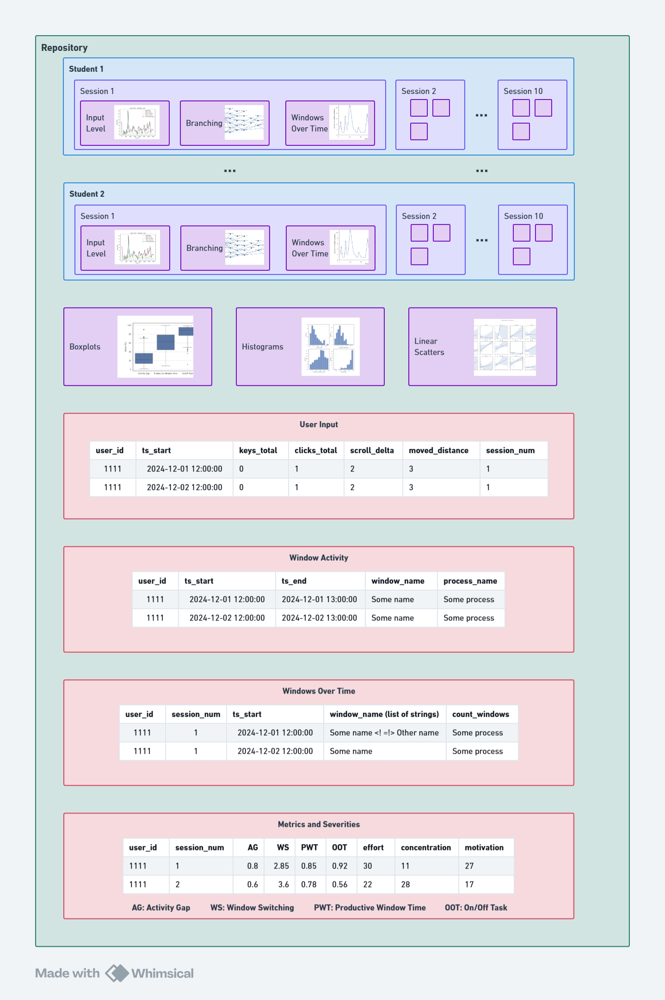

# Towards an Ecologically Valid Approach of Assessing ADHD Symptoms: Mining Patterns in Automatically Collected, Real World Computer Activity Data

This repository contains the data that was used to calculate metrics, generate figures, and analyze statistical relationships between variables in the study "Towards an Ecologically Valid Approach of Assessing ADHD Symptoms: Mining Patterns in Automatically Collected, Real World Computer Activity Data".

Furthermore, the structure of this data store is as follows:

- All graphs for all users are within their respective directories
- All the data files that were used to generate each graph on this entire repository, user-level or not, are in the root directory.
  - The [`combined_metrics_with_severity.csv`](./combined_metrics_with_severity.csv) file has all the values of all metrics and severity scores for all sessions and all users.
  - The [`user_input.csv`](./user_input.csv) file contains all of the interactions recorded throughout every session for all users.
  - The [`window_activity`](./window_activity.csv) file contains all window names used by every student in every session throughout the study.
  - The [`windows_over_time`](./windows_over_time.csv) file contains the window activity data with a normalized time component, meaning using the window activity file, we computed all the windows that were being used in a given time period within the session, and the length of the time periods was one minute.
- The [`dataset_partitioning`](./dataset_partitioning.json) file contains every student and their respective assigned dataset (train or test).
- The [`boxplots`](./boxplots/) directory contains the charts for both metrics and severities
- The [`histograms`](./histograms/) directory contains charts displaying the distributions for every metric, every metric in a logarithmic scale, and every severity.
- The [`linear_scatters`](./linear_scatters/) directory contains charts illustrating linear regressions for both the Activity Gap metric and the On/Off Task metric against every severity score (effort, concentration, and motivation).

The figure below illustrates the structure described above.

